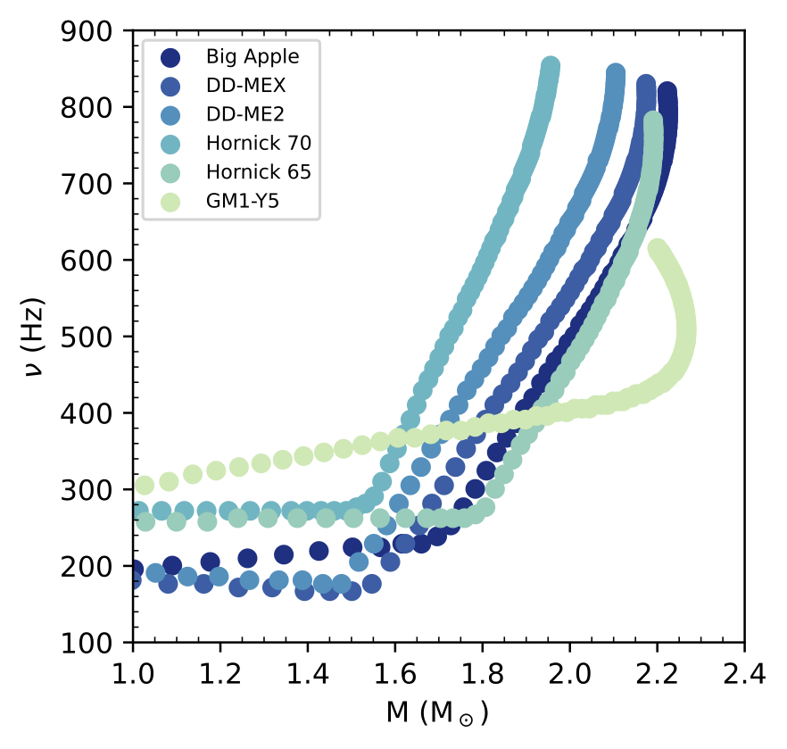

# g-mode Oscillations Hyperons

This repository consists of the code used to ultimately calculate the $g$-mode oscillations for compositions including nucleons and hyperons in the context of relativistic mean field (RMF) models, results of which are presented in a paper here (ArXiV:2212.09875). 

 

This is split up into three separate code segments that do three different things
1. Calculate the Equilibrium Parameters
2. Calculate the Adiabatic Sound Speed/Sound Speed Difference
3. Calculate Structure, g-mode oscillations and Tidal Deformability 

## Equilibrium Parameters
The first thing that we'd like to find is the equation of state: $p(\epsilon)$. In RMF models this reduces to determining the particle momentum $k_{F_i}$ and meson field values (we calculate these values as a function of baryon number density $n_B$). Knowing these two things gives us $p(\epsilon)$. There are expressions for these things in numerous papers, see for instance, Glendenning 1985. The sort of workflow is as follows:
1. Start from a given Lagrangian that describes the DOF, the specific baryon-meson and meson-meson interactions. By hand, determine the EL-equations for the mesons in the mean-field approximation. This is in principle all we need to do by hand. 
2. Update the code definitions 

### Code Specifics
The code is structured as follows. It relies heavily on object-oriented programming for the sake of generalizing to arbitrary number of particles. 
1. We firstly have the `NLW_classes.py` file. In here, we define relevant constants such as $\hbar c = 197.3 MeV/fm$ and give important class definitions. We define an `eos` class. This holds all of the 
    -   We have an `eos` class. 
    -   We define a `particle` class. This is a parent class for all particles and stores parameters for a given particle such as `mass`, `charge`, `number density`, etc. A specific particle, ie, `electron` would be an instance of this class with `mass` set to $\sim 0.5$ MeV. Then at any time the specific property can just be recalled by calling `electron.mass`. From this parent class, we define child classes: `baryon`, `lepton`, and `meson` that inherit these properties but then have additional functionality (for example, calculating $E_{F_i}$ is different for baryons which interact versus leptons which don't) and allow for summing over mesons or baryons separately. At the end of this file we initialie the particles. 
3. We have an `NLW_eos.py` file. 
    -   In this file, we initialize the equation of states/models used and their relevant parameters. Depends on `NLW_classes.py`. 
4. Finally, we have a `NLW_solver_func.py` file. This defines functions that generate/return the equations of motion of mesons and other constraints (charge neutrality, baryon number conservation, and chemical equilibrium with respect to weak processes) and plug into a system of non-linear solvers. 

